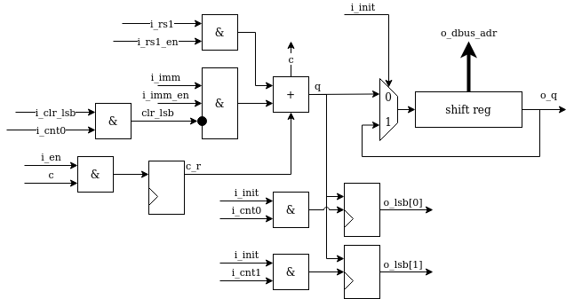
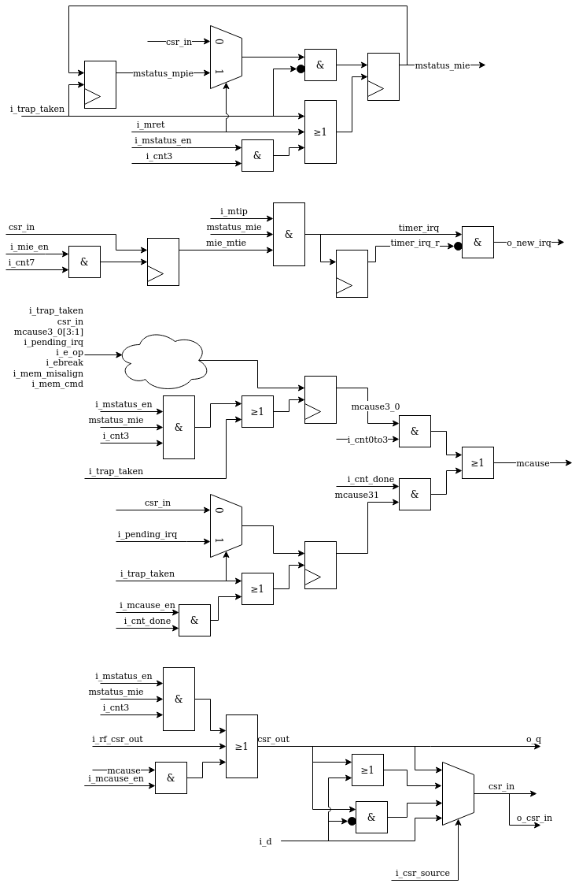
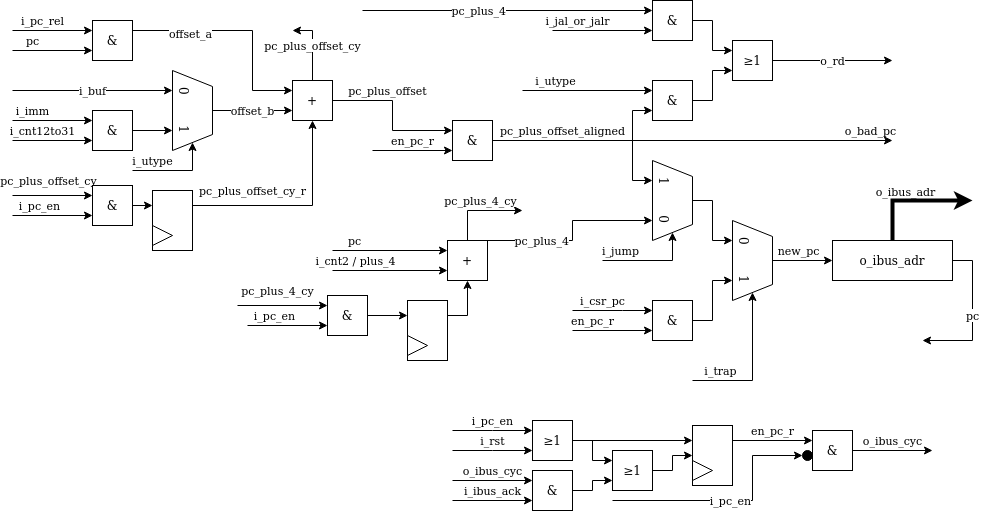
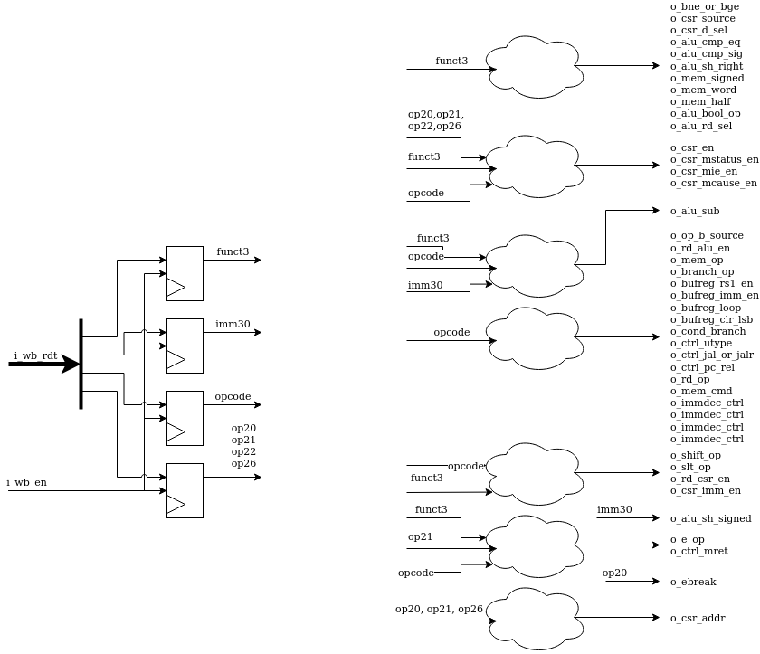
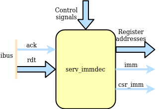
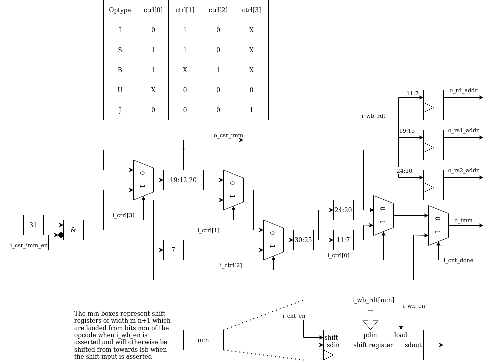
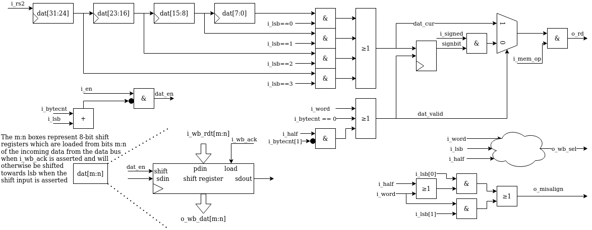

.. SERV documentation master file, created by
   sphinx-quickstart on Mon Feb 24 00:01:33 2020.
   You can adapt this file completely to your liking, but it should at least
   contain the root `toctree` directive.

SERV user manual
================

.. toctree::
   :maxdepth: 2
   :caption: Contents:

Modules
-------

SERV is a bit-serial CPU which means that the internal datapath is one bit wide. :ref:`dataflow` show the internal dataflow. For each instruction, data is read from the register file or the immediate fields of the instruction word and the result of the operation is stored back into the register file. Reading and writing memory is handled through the memory interface module.

.. _dataflow:

.. figure:: serv_dataflow.png

   SERV internal dataflow

serv_rf_top
^^^^^^^^^^^

.. image:: serv_rf_top.png

serv_rf_top is a top-level convenience wrapper that includes SERV and the default RF implementation and just exposes the timer IRQ and instruction/data wishbone buses.

serv_top
^^^^^^^^

serv_top is the top-level of the SERV core without an RF

serv_alu
^^^^^^^^

.. image:: serv_alu.png

serv_alu handles alu and shift operations. The first input operand (A) comes from i_rs1 and the second operand (B) comes from i_rs2 or i_imm depending on the type of operation. The data passes through one or more of the add/sub, shift control or bool logic unit and finally ends up in o_rd to be written to the destination register. The output o_cmp is used for conditional branches to decide whether or not to take the branch.

The add/sub unit can do additions A+B or subtractions A-B by converting it to A+B̅+1. Subtraction mode (i_sub = 1) is also used for the comparisions in the slt* and conditional branch instructions. Finally, it is also used to negate the B operand for left shifts by clearing the A operand (i_shift_op =1). The +1 used in subtraction mode is done by preloading the carry input with 1. Less-than comparisons are handled by converting the expression A<B to A-B<0 and checking the MSB, which will be set when the result is less than 0. This however requires sign-extending the operands to 33-bit inputs. For signed operands (when i_cmp_sig is set), the extra bit is the same as the MSB. For unsigned, the extra bit is always 0. Because the ALU is only active for 32 cycles, the 33rd bit must be calculated in parallel to the ordinary addition. The result from this operations is available in result_lt. For equality checks, result_eq checks that all bits are 0 from the subtraction.

For shift operations, the data to be shifted resides in bufreg. The shift control unit in the ALU keeps track of how many steps to shift the bufreg and sign-extends/zero-pads the shifted data depending on the type (arithmetic/logic right/left) of shift operation

.. image:: serv_alu_int.png

serv_bufreg
^^^^^^^^^^^

.. image:: serv_bufreg.png

For two-stage operations, serv_bufreg holds data between stages. This data can be the effective address for branches or load/stores or data to be shifted for shift ops. It has a serial output for streaming out results during stage two and a parallel output that forms the dbus address. serv_bufreg also keeps track of the two lsb when calculating adresses. This is used to check for alignment errors. In order to support these different modes, the input to the shift register can come from rs1, the immediate (imm), rs1+imm or looped back from the shift register output. The latter is used for shift operations. For some operations, the LSB of the immediate is cleared before written to the shift register. bufreg also latches and exposes the two LSB bits of the data written to the shift register. These are used to check data/address alignment issues early.

serv_csr
^^^^^^^^

.. image:: serv_csr.png

serv_csr handles CSR accesses and all status related to (timer) interrupts. Out of the eight CSRs supported by SERV, only four resides in serv_csr (mstatus, mie, mcause and mip) and for those registers, SERV only implement the bits required for ecall, ebreak, misalignment and timer interrupts. The four remaining CSRs are commonly stored in the RF

serv_ctrl
^^^^^^^^^

.. image:: serv_ctrl.png

serv_ctrl keeps track of the current PC and contains the logic needed to calculate the next PC. The PC is stored in shift register with a parellel output connected to the instruction bus.

The new PC can come from three sources. For normal instructions, it is incremented by four, which is the next 32-bit address. Jumps can be absolute or relative to the current PC. Absolute jumps are precalculated in serv_bufreg and written directly to the PC. PC relative jumps have the offset part precalculated in serv_bufreg which gets added to the current PC before storing as the new PC. The third source for the new PC comes from the CSR registers when entering or returning traps.

Some operations (LUI, AUIPC, jumps, entering or returning from traps) also update the destination register through o_rd. In the case of misaligned instruction traps, the invalid PC is written to o_bad_pc to be passed to mtval.

serv_decode
^^^^^^^^^^^

.. image:: serv_decode.png

serv_decode is responsible for decoding the operation word coming from ibus into a set of control signals that are used internally in SERV.

serv_immdec
^^^^^^^^^^^

The main responsibility of serv_immdec is to stitch together the pieces of immediates from the instruction word and push it out in the correct order. When a new instruction arrives, the relevant parts are placed into a number of shift registers, and the connections between the registers are setup differently depending on the type of operation.

serv_immdec also extracts the register addresses from the operation word.

serv_mem_if
^^^^^^^^^^^

.. image:: serv_mem_if.png

serv_mem_if prepares the data to be sent out on the dbus during store operations and serializes the incoming data during loads

The memory interface is centered around four byte-wide shift registers connected in series. During store operations, the `dat_en` signal is asserted long enough to shift in the data from rs2 to the right place in the shift registers and the parallel output of the shift registers is then presented to the data bus as a 32-bit word together with a byte mask. The `Data bus byte mask`_ table summarizes the logic for when the individual byte select signals are asserted depending on the two LSB of the data address together with the size (byte, halfword, word) of the write operation.

During load operations, the data from the bus is latched into the shift registers. `dat_en` is again asserted to shift out data from the registers. `i_lsb` decides from which byte stage of the shift register to tap the data, depending on the alignment of the received data. The `dat_valid` signal makes sure to only present valid data to `o_rd` and otherwise fill in with zeros or sign extension.

When SERV is built with `WITH_CSR`, there is also logic to detect misaligned accesses which asserts the o_misalign flag to the core.

.. _`Data bus byte mask`:

+-------+---+---------------------+-----------------+----------------------+-------------+
|op type|lsb|                    3|                2|                     1|            0|
+=======+===+=====================+=================+======================+=============+
|sb     | 00|                    0|                0|                     0|            1|
+-------+---+---------------------+-----------------+----------------------+-------------+
|sb     | 01|                    0|                0|                     1|            0|
+-------+---+---------------------+-----------------+----------------------+-------------+
|sb     | 10|                    0|                1|                     0|            0|
+-------+---+---------------------+-----------------+----------------------+-------------+
|sb     | 11|                    1|                0|                     0|            0|
+-------+---+---------------------+-----------------+----------------------+-------------+
|sh     | 00|                    0|                0|                     1|            1|
+-------+---+---------------------+-----------------+----------------------+-------------+
|sh     | 10|                    1|                1|                     0|            0|
+-------+---+---------------------+-----------------+----------------------+-------------+
|sw     | 00|                    1|                1|                     1|            1|
+-------+---+---------------------+-----------------+----------------------+-------------+
|Logic      |`(i_lsb == 11) |`    |`(i_lsb == 10 |)`|`(i_lsb == 01) |`     |`i_lsb == 0` |
|expression |`i_word |`           |`i_word`         |`i_word |`            |             |
|	    |`(i_half & i_lsb[1])`|                 |`(i_half & !i_lsb[1])`|             |
+-------+---+---------------------+-----------------+----------------------+-------------+

serv_rf_if
^^^^^^^^^^

serv_rf_if is the gateway between the core and an RF implementation. It transforms all control signals that affect register reads or writes and exposes two read and write ports to the RF. This allows implementors to plug in an RF implementation that is best suited for the technology to be used.

serv_rf_ram
^^^^^^^^^^^

serv_rf_ram is the default RF implementation using an SRAM-like interface. Suitable for FPGA implementations

serv_rf_ram_if
^^^^^^^^^^^^^^

serv_rf_ram_if converts between the SERV RF IF and the serv_rf_ram interface

serv_state
^^^^^^^^^^

serv_state keeps track of the state for the core and contains all dynamic control signals during an operations life time. Also controls the accesses towards the RF, ibus and dbus

New instructions are fetched by asserting o_ibus_cyc until there is a response on i_ibus_ack. Instruction fetches occur when the reset signal is deasserted, which is what gets SERV started, or when the PC has finished updating its value.

shift_reg
^^^^^^^^^

shift_reg is a shift register implementation used in various places in SERV

serv_shift
^^^^^^^^^^

serv_shift lives inside the ALU and contains the control logic for shift operations
