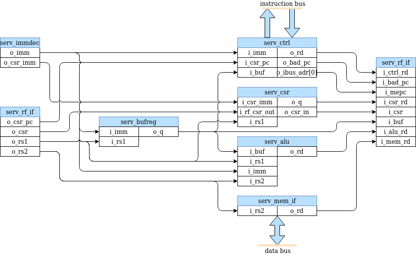
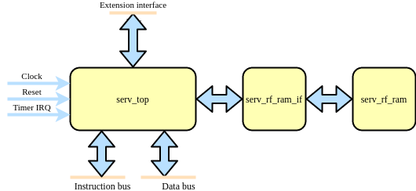
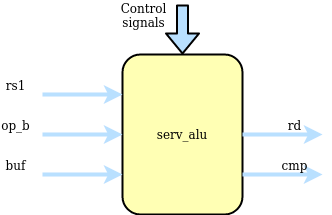
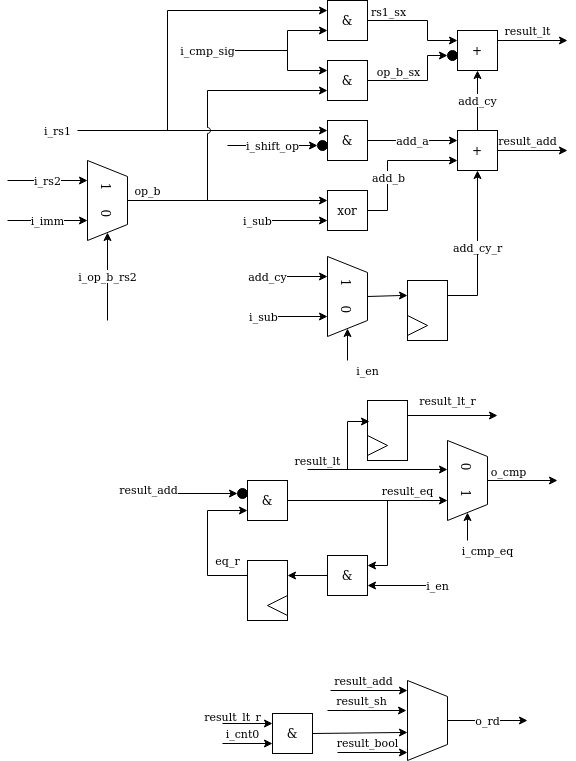
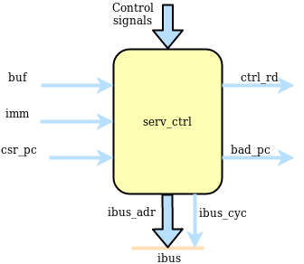
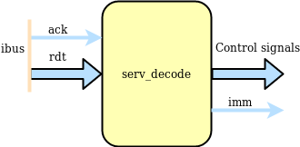
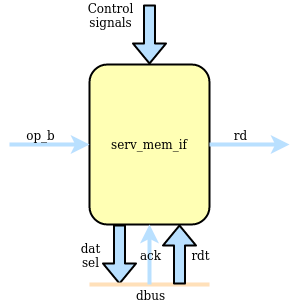

.. SERV documentation master file, created by
   sphinx-quickstart on Mon Feb 24 00:01:33 2020.
   You can adapt this file completely to your liking, but it should at least
   contain the root `toctree` directive.

SERV user manual
================================

.. toctree::
   :maxdepth: 2
   :caption: Contents:

Indices and tables
==================

* :ref:`genindex`
* :ref:`modindex`
* :ref:`search`

Modules
-------

SERV is a bit-serial CPU which means that the internal datapath is one bit wide. :ref:`dataflow` show the internal dataflow. For each instructions, data is read from the register file or the immediate fields of the instruction word and the result of the operation is stored back into the register file. Reading and writing memory is handled through the memory interface module.

.. _dataflow:

   SERV internal dataflow

serv_rf_top
^^^^^^^^^^^

serv_rf_top is a top-level convenience wrapper that includes SERV and the default RF implementation and just exposes the timer IRQ and instruction/data wishbone buses.

serv_top
^^^^^^^^

serv_top is the top-level of the SERV core without an RF

serv_alu
^^^^^^^^

serv_alu handles alu and shift operations. The first input operand (A) comes from i_rs1 and the second operand (B) comes from i_rs2 or i_imm depending on the type of operation. The data passes through one or more of the add/sub, shift control or bool logic unit and finally ends up in o_rd to be written to the destination register. The output o_cmp is used for conditional branches to decide whether or not to take the branch.

The add/sub unit can do additions A+B or subtractions A-B by converting it to A+B̅+1. Subtraction mode (i_sub = 1) is also used for the comparisions in the slt* and conditional branch instructions. Finally, it is also used to negate the B operand for left shifts by clearing the A operand (i_shift_op =1). The +1 used in subtraction mode is done by preloading the carry input with 1. Less-than comparisons are handled by converting the expression A<B to A-B<0 and checking the MSB, which will be set when the result is less than 0. This however requires sign-extending the operands to 33-bit inputs. For signed operands (when i_cmp_sig is set), the extra bit is the same as the MSB. For unsigned, the extra bit is always 0. Because the ALU is only active for 32 cycles, the 33rd bit must be calculated in parallel to the ordinary addition. The result from this operations is available in result_lt. For equality checks, result_eq checks that all bits are 0 from the subtraction.

For shift operations, the data to be shifted resides in bufreg. The shift control unit in the ALU keeps track of how many steps to shift the bufreg and sign-extends/zero-pads the shifted data depending on the type (arithmetic/logic right/left) of shift operation

serv_bufreg
^^^^^^^^^^^

.. image:: serv_bufreg.png

For two-stage operations, serv_bufreg holds data between stages. This data can be the effective address for branches or load/stores or data to be shifted for shift ops. It has a serial output for streaming out results during stage two and a parallel output that forms the dbus address. serv_bufreg also keeps track of the two lsb when calculating adresses. This is used to check for alignment errors

serv_csr
^^^^^^^^

.. image:: serv_csr.png

serv_csr handles CSR accesses and all status related to (timer) interrupts. Out of the eight CSRs supported by SERV, only four resides in serv_csr (mstatus, mie, mcause and mip) and for those registers, SERV only implement the bits required for ecall, ebreak, misalignment and timer interrupts. The four remaining CSRs are commonly stored in the RF

serv_ctrl
^^^^^^^^^

serv_ctrl keeps track of the current PC and contains the logic needed to calculate the next PC.

serv_decode
^^^^^^^^^^^

serv_decode is responsible for decoding the operation word coming from ibus into a set of control signals that are used internally in SERV. It also assembles the 32-bit immediate used by some instructions. During the life cycle of an operation all control signals (except one) are static and the immediate is streamed out during the first run stage

serv_mem_if
^^^^^^^^^^^

serv_mem_if prepares the data to be sent out on the dbus during store operations and serializes the incoming data during loads

serv_rf_if
^^^^^^^^^^

serv_rf_if is the gateway between the core and an RF implementation. It transforms all control signals that affect register reads or writes and exposes two read and write ports to the RF. This allows implementors to plug in an RF implementation that is best suited for the technology to be used.

serv_rf_ram
^^^^^^^^^^^

serv_rf_ram is the default RF implementation using an SRAM-like interface. Suitable for FPGA implementations

serv_rf_ram_if
^^^^^^^^^^^^^^

serv_rf_ram_if converts between the SERV RF IF and the serv_rf_ram interface

serv_state
^^^^^^^^^^

serv_state keeps track of the state for the core and contains all dynamic control signals during an operations life time. Also controls the accesses towards the RF and dbus

shift_reg
^^^^^^^^^

shift_reg is a shift register implementation used in various places in SERV

serv_shift
^^^^^^^^^^

serv_shift lives inside the ALU and contains the control logic for shift operations
