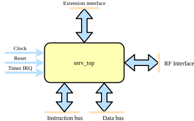

Interface
=========

Users of SERV can choose to use either serv_top or serv_rf_top depending on what best fits the application. serv_top contains all the main logic of SERV except for the actual storage for the register file (RF).

serv_rf_top is a convenience wrapper that combines serv_top with a memory-based RF (serf_rf_ram) and an adapter between them (serv_rf_ram_if). This allows users to choose between a drop-in implemenentation when the memory-based RF is good enough or supply an alternative RF implementation, such as a shift-register based one or a combined SRAM for instruction/data memory and RF.

.. image:: serv_rf_top.png

This means that serv_top exposes some additional pins to connect the RF which are not in serv_rf_top, while serv_rf_top has some extra parameters for configuring the RF. Aside from that, both modules expose a timer interrupt (only used when WITH_CSR=1), a rvfi formal interface (only available when RISCV_FORMAL is defined), an instruction bus, a data bus, and the extension interface.

Parameters
----------

.. list-table:: Parameters
   :header-rows: 1
   :widths: 10 20 80

   * - Parameter
     - Values
     - Description
   * - MDU
     - 0 (default), 1
     - Enables the interface for connecting SERV and the Multiplication and Division Unit (MDU). Note that this only enables the interface and the decoder logic. The MDU itself must be connected externally as well.
   * - PRE_REGISTER
     - 0, 1 (default)
     - | Register signals before or after the decoder
       | 0 : Register after the decoder. Faster but uses more resources
       | 1 : (default) Register before the decoder. Slower but uses less resources
   * - RESET_PC
     - 0x00000000 (default) - 0xFFFFFFFC
     - Address of first instruction to fetch from memory after reset (Reset vector)
   * - RESET_STRATEGY
     - "MINI" (default), "NONE"
     - | Amount of reset applied to design
       | "NONE" : No reset at all. Relies on a POR to set correct initialization values and that core isn't reset during runtime
       | "MINI" : Standard setting. Resets the minimal amount of FFs needed to restart execution from the instruction at RESET_PC.
   * - RF_WIDTH
     - 2 (default), 4, 8, 16, 32
     - (serv_rf_top only) Width of the RF memory. Typically smaller values use less resources, but can be implementation-dependant.
   * - WITH_CSR
     - 0, 1 (default)
     - Enable Zicsr extension. This also enables timer IRQ and exception handling. Note that SERV only implements a small subset of the CSR registers.

Signals
-------

.. list-table:: Signals
   :header-rows: 1
   :widths: 30 10 5 75

   * - Signal
     - Width
     - Direction
     -  Description
   * - clk
     - 1
     - in
     - Clock
   * - i_rst
     - 1
     - in
     - Synchronous reset
   * - i_timer_irq
     - 1
     - in
     - Timer interrupt
   * - o_ibus_adr
     - 32
     - out
     - Instruction bus address
   * - o_ibus_cyc
     - 1
     - out
     - Instruction bus active cycle
   * - i_ibus_rdt
     - 32
     - in
     - Instruction bus read data
   * - i_ibus_ack
     - 1
     - in
     - Instruction bus cycle acknowledged
   * - o_dbus_adr
     - 32
     - out
     - Data bus address
   * - o_dbus_dat
     - 32
     - out
     - Data bus write data
   * - o_dbus_sel
     - 4
     - out
     - Data bus write data byte select mask
   * - o_dbus_we
     - 1
     - out
     - Data bus write transaction
   * - o_dbus_cyc
     - 1
     - out
     - Data bus active cycle
   * - i_dbus_rdt
     - 32
     - in
     - Data bus return data
   * - i_dbus_ack
     - 1
     - in
     - Data bus return data valid
   * - o_ext_rs1
     - 32
     - out
     - Extension interface RS1 contents
   * - o_ext_rs2
     - 32
     - out
     - Extension interface RS2 contents
   * - o_ext_funct3
     - 3
     - out
     - Extension interface funct3 contents
   * - i_ext_rd
     - 32
     - in
     - Extension interface RD contents
   * - i_ext_ready
     - 1
     - in
     - Extension interface RD contents valid
   * - o_mdu_valid
     - 1
     - out
     - MDU request
   * - **serv_top only**
     -
     -
     -
   * - o_rf_rreq
     - 1
     - out
     - RF interface read request
   * - o_rf_wreq
     - 1
     - out
     - RF interface write request
   * - i_rf_ready
     - 1
     - in
     - RF interface request acknowledged
   * - o_wreg0
     - 5 + WITH_CSR
     - out
     - RF interface channel 0 write address
   * - o_wreg1
     - 5 + WITH_CSR
     - out
     - RF interface channel 1 write address
   * - o_wen0
     - 1
     - out
     - RF interface channel 0 write enable
   * - o_wen1
     - 1
     - out
     - RF interface channel 1 write enable
   * - o_wdata0
     - 1
     - out
     - RF interface channel 0 write data
   * - o_wdata1
     - 1
     - out
     - RF interface channel 1 write data
   * - o_rreg0
     - 5 + WITH_CSR
     - out
     - RF interface channel 0 read address
   * - o_rreg1
     - 5 + WITH_CSR
     - out
     - RF interface channel 1 read address
   * - i_rdata0
     - 1
     - in
     - RF interface channel 0 read data
   * - i_rdata1
     - 1
     - in
     - RF interface channel 1 read data
