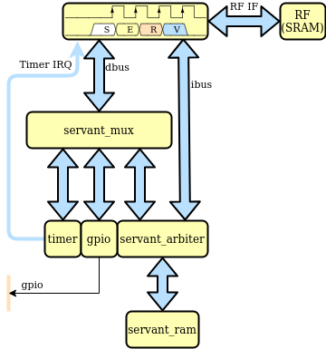

Servant : FPGA Reference platform
=================================

   Servant FPGA Reference platform

SERV comes with a small FPGA-focused reference platform called Servant, which is capable of running Zephyr RTOS, the regression test suite and other software. The platform consists of SERV, a timer, memory and a 1-bit GPIO output pin.

Available targets
-----------------

The servant SoC has been ported to an increasing number of different FPGA boards and is easy to modify for new targets. To see all currently supported targets run:

    fusesoc core show servant

By default, these targets have the program memory preloaded with a small Zephyr hello world example that writes its output on a UART pin. Don't forget to install the appropriate toolchain (e.g. icestorm, Vivado, Quartus...) and add to your PATH

Some targets also depend on functionality in the FuseSoC base library (fusesoc-cores). Running `fusesoc library list` should tell you if fusesoc-cores is already available. If not, add it to your workspace with

    fusesoc library add fusesoc-cores https://github.com/fusesoc/fusesoc-cores

Now we're ready to build. Note, for all the cases below, it's possible to run with `--memfile=$SERV/sw/blinky.hex`
(or any other suitable program) as the last argument to preload the LED blink example
instead of hello world.

Alhambra II
^^^^^^^^^^^

Pin 61 is used for UART output with 115200 baud rate. This pin is connected to a FT2232H chip in board, that manages the communications between the FPGA and the computer.

    fusesoc run --target=alhambra servant
    iceprog -d i:0x0403:0x6010:0 build/servant_1.0.1/alhambra-icestorm/servant_1.0.1.bin

Alinx ax309 (Spartan6 LX9)
^^^^^^^^^^^^^^^^^^^^^^^^^^

Pin D12 (the on-board RS232 TX pin) is used for UART output with 115200 baud rate and wired to Pin P4 (LED0).

    fusesoc run --target=ax309 servant

Arty A7 35T
^^^^^^^^^^^

Pin D10 (uart_rxd_out) is used for UART output with 57600 baud rate (to use
blinky.hex change D10 to H5 (led[4]) in data/arty_a7_35t.xdc).

    fusesoc run --target=arty_a7_35t servant

Arty S7 50T
^^^^^^^^^^^

Pin R12 (uart_rxd_out) is used for UART output with 57600 baud rate (to use
blinky.hex change R12 to E18 (led[4]) in data/arty_s7_50t.xdc).

    fusesoc run --target=arty_s7_50t servant

Chameleon96 (Arrow 96 CV SoC Board)
^^^^^^^^^^^^^^^^^^^^^^^^^^^^^^^^^^^

FPGA Pin W14 (1V8, pin 5 low speed connector) is used for UART Tx output with 115200 baud rate. No reset key. Yellow Wifi led is q output.

    fusesoc run --target=chameleon96 servant

CMOD A7 35t
^^^^^^^^^^^

FPGA Pin J18 is used for UART output with 57600 baud rate. btn0 is used for reset.

    fusesoc run --target=cmod_a7_35t servant

DE0 Nano
^^^^^^^^

FPGA Pin D11 (Connector JP1, pin 38) is used for UART output with 57600 baud rate. DE0 Nano needs an external 3.3V UART to connect to this pin

    fusesoc run --target=de0_nano servant

DE10 Nano
^^^^^^^^^

FPGA Pin Y15 (Connector JP7, pin 1) is used for UART output with 57600 baud rate. DE10 Nano needs an external 3.3V UART to connect to this pin

    fusesoc run --target=de10_nano servant

DE1 SoC revF
^^^^^^^^^^^^

FPGA PIN_AC18 (Connector GPIO0, pin 0) is used for UART output with 57600 baud rate. DE1 SoC revF needs an external 3.3V UART to connect to this pin. The UART pin has not been tested.

    fusesoc run --target=de1_soc_revF servant

DECA development kit
^^^^^^^^^^^^^^^^^^^^

FPGA Pin W18 (Pin 3 P8 connector) is used for UART output with 57600 baud rate. Key 0 is reset and Led 0 q output.

    fusesoc run --target=deca servant

EBAZ4205 'Development' Board
^^^^^^^^^^^^^^^^^^^^^^^^^^^^

Pin B20 is used for UART output with 57600 baud rate. To use `blinky.hex`
change B20 to W14 (red led) in `data/ebaz4205.xdc` file).

    fusesoc run --target=ebaz4205 servant

    fusesoc run --target=ebaz4205 servant --memfile=$SERV/sw/blinky.hex

Reference: https://github.com/fusesoc/blinky#ebaz4205-development-board

Icebreaker
^^^^^^^^^^

Pin 9 is used for UART output with 57600 baud rate.

    fusesoc run --target=icebreaker servant

iCEstick
^^^^^^^^

Pin 95 is used as the GPIO output which is connected to the board's green LED. Due to this board's limited Embedded BRAM, programs with a maximum of 7168 bytes can be loaded. The default program for this board is blinky.hex.

    fusesoc run --target=icestick servant
    iceprog build/servant_1.2.1/icestick-icestorm/servant_1.2.1.bin

iCESugar
^^^^^^^^

Pin 6 is used for UART output with 115200 baud rate. Thanks to the onboard
debugger, you can just connect the USB Type-C connector to the PC, and a
serial console will show up.

    fusesoc run --target=icesugar servant

ICE-V Wireless
^^^^^^^^^^^^^^

Pin 9 is used for UART output with 57600 baud rate.

    fusesoc run --target=icev_wireless servant

    iceprog build/servant_1.2.1/icestick-icestorm/servant_1.2.1.bin

Machdyne Kolibri
^^^^^^^^^^^^^^^^

Pin B1 is used for UART output with 115200 baud rate. The serial port on Kolibri is accessible as a USB-CDC device.

    fusesoc run --target=machdyne_kolibri servant

    ldprog -Ks build/servant_1.2.1/machdyne_kolibri-icestorm/servant_1.2.1.bin

Nandland Go Board
^^^^^^^^^^^^^^^^^

Pin 56 is used as the GPIO output which is connected to the board's LED1. Due to this board's limited Embedded BRAM, programs with a maximum of 7168 bytes can be loaded. The default program for this board is blinky.hex.

    fusesoc run --target=go_board servant
    iceprog build/servant_1.2.1/go_board-icestorm/servant_1.2.1.bin

Nexys 2
^^^^^^^

Pmod pin JA1 is connected to UART tx with 57600 baud rate. A USB to TTL connector is used to display to hello world message on the serial monitor.
(To use blinky.hex change L15 to J14 (led[0]) in data/nexys_2.ucf).

    fusesoc run --target=nexys_2_500 servant --uart_baudrate=57600 --firmware=$SERV/sw/zephyr_hello.hex

OrangeCrab R0.2
^^^^^^^^^^^^^^^

Pin D1 is used for UART output with 115200 baud rate.

    fusesoc run --target=orangecrab_r0.2 servant
    dfu-util -d 1209:5af0 -D build/servant_1.2.1/orangecrab_r0.2-trellis/servant_1.2.1.bit

PolarFire Splash Kit
^^^^^^^^^^^^^^^^^^^^

Pin R5 is used for UART output with a 115200 baud rate, this is routed through
the onboard FTDI transceiver. LED1 (Pin P7) serves as the generic GPIO.

Pin P8 is used as the GPIO heartbeat with a 1Hz frequency and is connected to
the board's LED2.

Pin N4 (user reset) is used for the reset

    fusesoc run --target=polarfire_splashkit servant --memfile=$SERV/sw/zephyr_hello.hex

Saanlima Pipistrello (Spartan6 LX45)
^^^^^^^^^^^^^^^^^^^^^^^^^^^^^^^^^^^^

Pin A10 (usb_data<1>) is used for UART output with 57600 baud rate (to use
blinky.hex change A10 to V16 (led[0]) in data/pipistrello.ucf).

    fusesoc run --target=pipistrello servant

SoCKit development kit
^^^^^^^^^^^^^^^^^^^^^^

FPGA Pin F14 (HSTC GPIO addon connector J2, pin 2) is used for UART output with 57600 baud rate.

    fusesoc run --target=sockit servant

TinyFPGA BX
^^^^^^^^^^^

Pin A6 is used for UART output with 115200 baud rate.

    fusesoc run --target=tinyfpga_bx servant
    tinyprog --program build/servant_1.0.1/tinyfpga_bx-icestorm/servant_1.0.1.bin

Porting Servant to a new target
-------------------------------

Mostly any FPGA board can be used to run the Servant SoC. In its simplest form it just needs an FPGA with a clock input and an output that can be used to connect an UART or a LED.

The porting process consists of FIXME steps.
We will use `<name>` as a placeholder for the name of the FPGA board.
1. Locate the pins used for clock input and for the outputs. Outputs should preferably be both a LED and an UART, but either works if not both are available. Optionally, locate an input pin connected to the reset as well. This is not required, but can be handy.
2. Write a pin constraints file with your located pins in the format of the FPGA toolchain you intend to use. For Vivado this would be an .xdc file. For Quartus a .tcl file, for nextpnr a .pcf file and so on. Save this as `data/<name>.{pcf,ucf,xdc...}` in the SERV repo.
3. Create a clock generation file
4. Create a top-level
5. Create a fileset
6. Create a target
