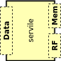
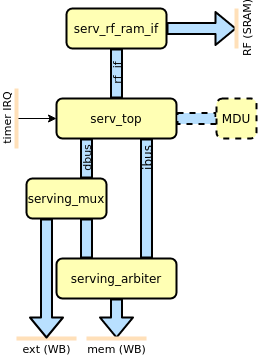

Servile : Convenience wrapper
=============================

   Servile convenience wrapper

Servile is a helper component that takes care of common configuration and is used as a building block in the other designs and subsystems. It exposes a memory bus intended to be connected to a combined data and instruction memory, an extension bus for peripheral controllers and accelerators and an RF interface for connecting to an SRAM for GPR and CSR registers.

   Servile block diagram

Internally, Servile contains logic for optionally instantiating an MDU core for the M extension, an arbiter to route instruction fetches and main memory accesses through the same interface and a mux to split up the memory map into memory (0x00000000-0x3FFFFFFF) and external accesses (0x40000000-0xFFFFFFFF). The mux also contains simulation-only logic to write output to a log file and stop the simulation.

Parameters
----------

.. list-table:: Parameters
   :header-rows: 1
   :widths: 10 20 80

   * - Parameter
     - Values
     - Description
   * - reset_pc
     - 0x00000000 (default) - 0xFFFFFFFC
     - Address of first instruction to fetch from memory after reset (Reset vector)
   * - reset_strategy
     - "MINI" (default), "NONE"
     - | Amount of reset applied to design
       | "NONE" : No reset at all. Relies on a POR to set correct initialization values and that core isn't reset during runtime
       | "MINI" : Standard setting. Resets the minimal amount of FFs needed to restart execution from the instruction at RESET_PC.
   * - rf_width
     - 2 (default), 4, 8, 16, 32
     - Width of the data bus to the RF memory. Typically smaller values use less resources, but can be implementation-dependant.
   * - sim
     - 0 (default), 1
     - | Enable simulation mode. In simulation mode, two memory addresses have special purposes.
       | 0x80000000: Writes to this address puts the byte in the lowest data byte into a log file decided by the "signature" plusarg.
       | 0x90000000: Writes to this address ends the simulation.
   * - with_c
     - 0 (default), 1
     - Enable the C extension. This also makes SERV support misaligned loads and stores.
   * - with_csr
     - 0 (default), 1
     - Enable the Zicsr extension. This also enables timer IRQ and exception handling. Note that SERV only implements a small subset of the CSR registers.
   * - with_mdu
     - 0 (default), 1
     - Enables the Multiplication and Division Unit (MDU) to support the M extension. Note that this only enables the interface and the decoder logic. The MDU itself is external from SERV.

Signals
-------

.. list-table:: Signals
   :header-rows: 1
   :widths: 30 10 5 75

   * - Signal
     - Width
     - Direction
     -  Description
   * - i_clk
     - 1
     - in
     - Clock
   * - i_rst
     - 1
     - in
     - Synchronous reset
   * - i_timer_irq
     - 1
     - in
     - Timer interrupt
   * - **Memory interface**
     -
     -
     - Connect to instruction/data memory
   * - o_wb_mem_adr
     - 32
     - out
     - Memory bus address
   * - o_wb_mem_dat
     - 32
     - out
     - Memory bus data
   * - o_wb_mem_sel
     - 4
     - out
     - Memory bus write data byte select mask
   * - o_wb_mem_we
     - 1
     - out
     - Memory bus write transaction
   * - o_wb_mem_stb
     - 1
     - out
     - Memory bus active strobe
   * - i_wb_mem_rdt
     - 32
     - in
     - Memory bus read data
   * - i_wb_mem_ack
     - 1
     - in
     - Memory bus cycle acknowledged
   * - **Extension interface**
     -
     -
     - Connect to peripheral controllers
   * - o_wb_ext_adr
     - 32
     - out
     - Data bus address
   * - o_wb_ext_dat
     - 32
     - out
     - Data bus write data
   * - o_wb_ext_sel
     - 4
     - out
     - Data bus write data byte select mask
   * - o_wb_ext_we
     - 1
     - out
     - Data bus write transaction
   * - o_wb_ext_stb
     - 1
     - out
     - Data bus active cycle
   * - i_wb_ext_rdt
     - 32
     - in
     - Data bus return data
   * - i_wb_ext_ack
     - 1
     - in
     - Data bus return data valid
   * - **RF (SRAM) interface**
     -
     -
     -
   * - o_rf_waddr
     - ceil(log2(regs*32/rf_width)
     - out
     - RF memory write address
   * - o_rf_wdata
     - rf_width
     - out
     - RF memory write data
   * - o_rf_wen
     - 1
     - out
     - RF memory write enable
   * - o_rf_raddr
     - ceil(log2(regs*32/rf_width)
     - out
     - RF memory read address
   * - i_rf_rdata
     - rf_width
     - out
     - RF memory read data
   * - o_rf_ren
     - 1
     - out
     - RF memory read enable
