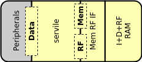

Serving : FPGA subsystem
========================

   Serving SoClet

Serving is ideal for FPGA implementations as it only uses a single combined block RAM for instructions, data and RF that can be preloaded with a RISC-V application. It exposes a wishbone data bus that can be used to connect peripheral controllers.

Parameters
----------

.. list-table:: Parameters
   :header-rows: 1
   :widths: 10 20 80

   * - Parameter
     - Values
     - Description
   * - memfile
     - "" (default)
     - Verilog hex file containing a RISC-V application to be preloaded into memory
   * - memsize
     -  1-4294967296 (default 8192)
     - Size of memory (in bytes). Needs to be at least large enough to fit the application supplied by memsize. Note that the RF occupies the highest 128 bytes of memory in the RAM.
   * - sim
     - 0 (default), 1
     - | Enable simulation mode. In simulation mode, two memory addresses have special purposes.
       | 0x80000000: Writes to this address puts the byte in the lowest data byte into a log file decided by the "signature" plusarg.
       | 0x90000000: Writes to this address ends the simulation.
   * - RESET_STRATEGY
     - "MINI" (default), "NONE"
     - | Amount of reset applied to design
       | "NONE" : No reset at all. Relies on a POR to set correct initialization values and that core isn't reset during runtime
       | "MINI" : Standard setting. Resets the minimal amount of FFs needed to restart execution from the instruction at RESET_PC.
   * - WITH_CSR
     - 0 (default), 1
     - Enable the Zicsr extension. This also enables timer IRQ and exception handling. Note that SERV only implements a small subset of the CSR registers.

Signals
-------

.. list-table:: Signals
   :header-rows: 1
   :widths: 30 10 5 75

   * - Signal
     - Width
     - Direction
     -  Description
   * - i_clk
     - 1
     - in
     - Clock
   * - i_rst
     - 1
     - in
     - Synchronous reset
   * - i_timer_irq
     - 1
     - in
     - Timer interrupt
   * - **Extension interface**
     -
     -
     - Connect to peripheral controllers
   * - o_wb_adr
     - 32
     - out
     - Data bus address
   * - o_wb_dat
     - 32
     - out
     - Data bus write data
   * - o_wb_sel
     - 4
     - out
     - Data bus write data byte select mask
   * - o_wb_we
     - 1
     - out
     - Data bus write transaction
   * - o_wb_cyc
     - 1
     - out
     - Data bus active cycle
   * - i_wb_rdt
     - 32
     - in
     - Data bus return data
   * - i_wb_ack
     - 1
     - in
     - Data bus return data valid
