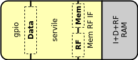

Subservient : SERV ASIC macro
=============================

   Subservient ASIC macro

`Subservient <https://github.com/olofk/subservient>`_ is a minimal reference system that just requires connecting one single-port SRAM for data, instructions and RF. It is intended to make ASIC integration easier.

