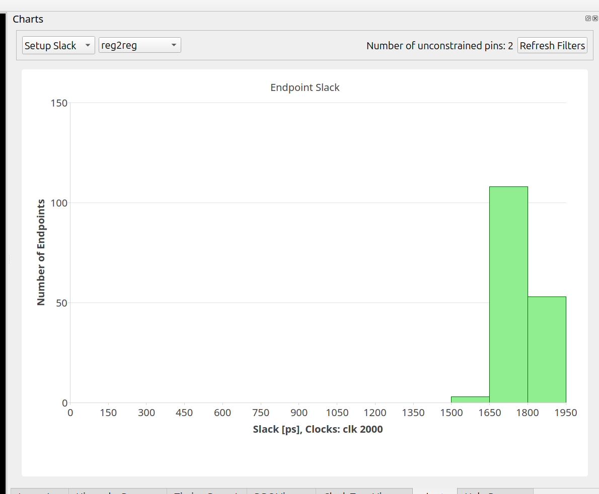
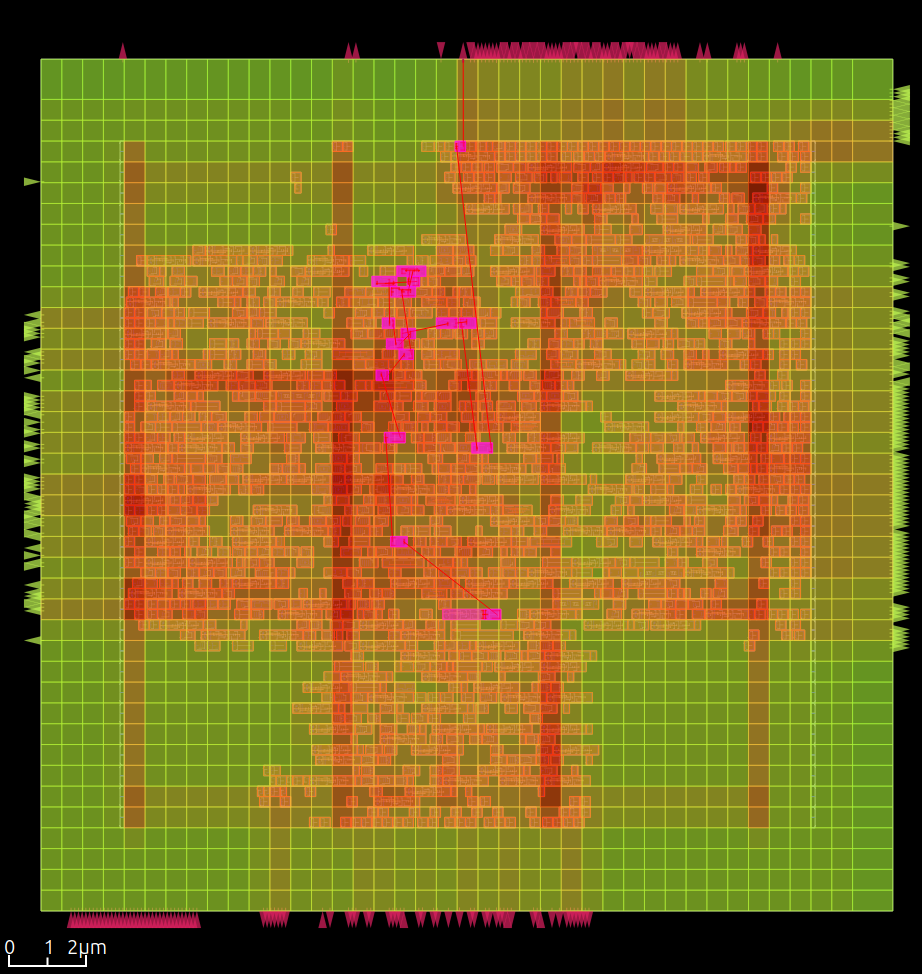
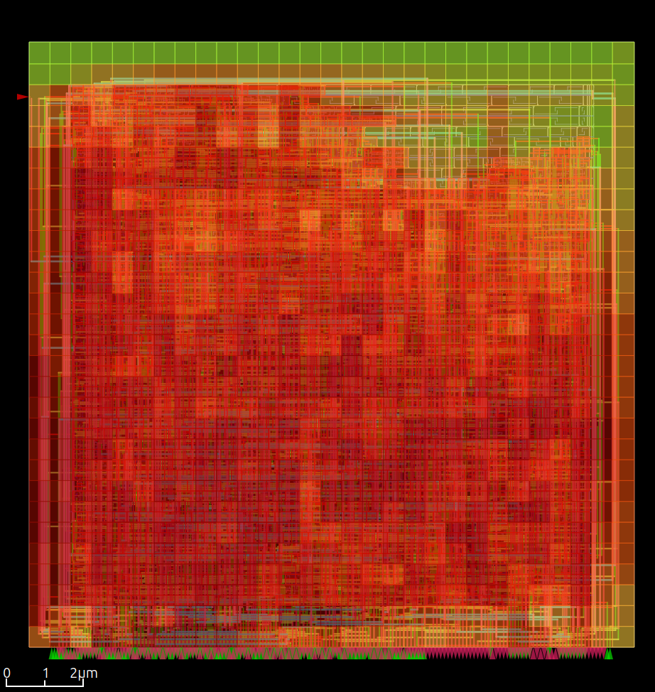
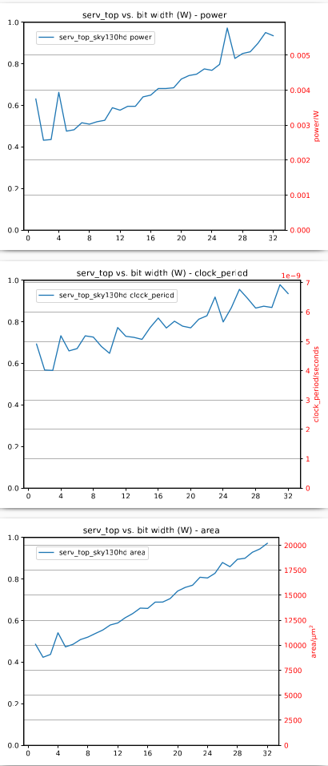

OpenROAD ASAP7 PDK configuration
================================

TL;DR Install Bazelisk and run command below to build and view darksocv in the GUI, Bazelisk handles all depedencies.

Demonstrates how to set up an [bazel-orfs](https://github.com/The-OpenROAD-Project/bazel-orfs) to build darksocv with [OpenROAD-flow-scripts](https://github.com/The-OpenROAD-Project/OpenROAD-flow-scripts)

To build and view [Install Bazelisk](https://bazel.build/install/bazelisk) and run:

    bazel run //openroad:serv_top_asap7_1_cts /tmp/cts gui_cts

Register to register histogram
------------------------------

Estimated routing congestion
----------------------------

Detailed routing and congestion
-------------------------------

    bazel run //openroad:serv_top_asap7_1_route /tmp/route gui_route

sky130hd
--------

    bazel run serv_top_sky130hd_32_cts /tmp/cts gui_cts

PPA plots
=========

View sky130hd PPA plots:

    bazel run //openroad:ppa_sky130hd

Ideas for future work
=====================

- reduce clock period
- adjust input/output delays
- add IO constraints to place pins on one edge of the SRAMs and top level
- reduce area

[MegaBoom](https://github.com/The-OpenROAD-Project/megaboom) demonstrates a number of techniques to study a design and set up mock SRAMs.
